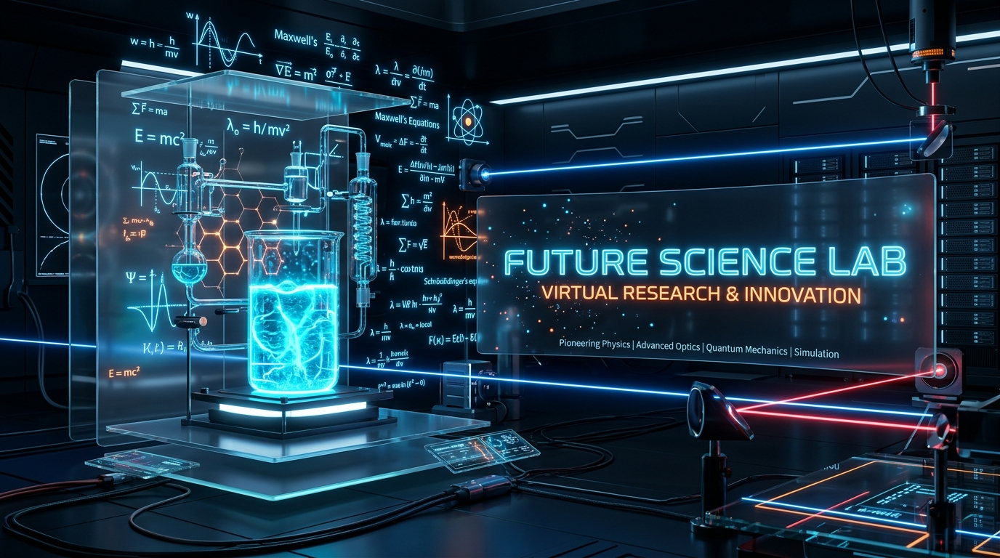

# Future Science Lab - LABSAINS 🧪✨

Platform Simulasi Praktikum Virtual Interaktif Berbasis AI dan Formulasi Presisi LaTeX untuk Tingkat Pendidikan SD, SMP, dan SMA.



## 🚀 Fitur Utama

- **Kurikulum Terstruktur Berdasarkan Tingkat Pendidikan**:
  - **SD (Pengenalan & Visual)**: Siklus Air, Magnet Sederhana, Mengapung & Tenggelam.
  - **SMP (Hubungan Antar Variabel)**: Tuas / Pengungkit, Pemuaian Termal Logam, Pembentukan Bayangan Cermin & Lensa.
  - **SMA (Analisis Data & Rumus LaTeX)**: Gerak Parabola, Hukum II Newton & Gaya Gesek, Titrasi Asam Basa, Rangkaian Listrik AC R-L-C.
- **Formulasi Presisi KaTeX (LaTeX)**: Render notasi matematika & kimia ilmiah standar publikasi sains.
- **Mesin Visual 3D & Canvas Vector**: Peluncur Roket Sci-Fi, Plasma Orb, Drone Eksperimental, Vektor Kecepatan Real-time, dan Efek Semburan Api.
- **Konektivitas Supabase**: Integrasi database dan autentikasi backend Supabase SDK.

---

## 🛠️ Teknologi yang Digunakan

- **Framework**: [Next.js 16 (App Router)](https://nextjs.org/)
- **Bahasa**: TypeScript
- **Styling**: Tailwind CSS v4 & Glassmorphism UI
- **Render Matematika**: KaTeX (`katex`)
- **Backend & Database**: Supabase (`@supabase/supabase-js`)
- **Ikon**: Lucide React (`lucide-react`)

---

## 💻 Cara Menjalankan Proyek Secara Lokal

1. **Clone repositori**:
   ```bash
   git clone https://github.com/gkhabibi1/future-science-lab.git
   cd future-science-lab
   ```

2. **Instal dependensi**:
   ```bash
   npm install
   ```

3. **Jalankan server pengembangan**:
   ```bash
   npm run dev
   ```

4. **Buka di peramban (browser)**:
   Navigasikan ke [http://localhost:3000](http://localhost:3000)

---

## 📝 Lisensi
Lisensi MIT © 2026 LABSAINS Future Science Lab.
